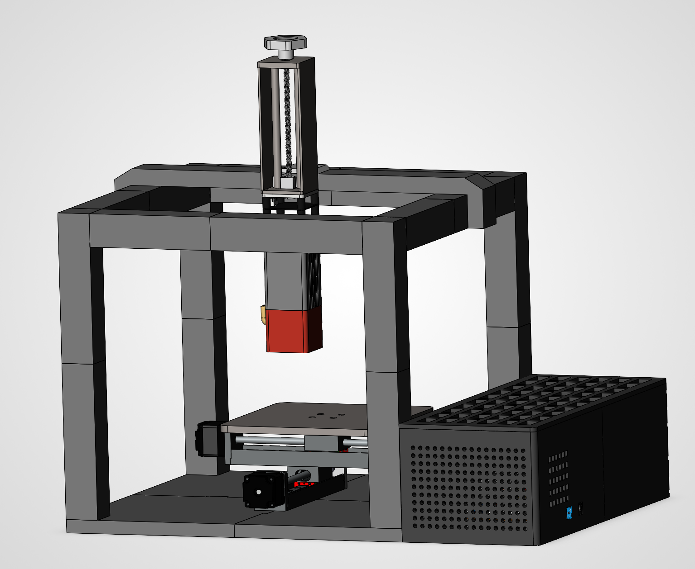
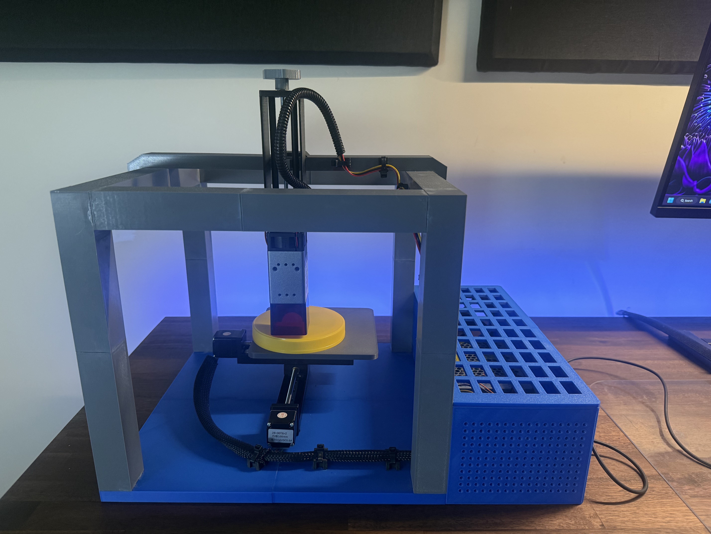
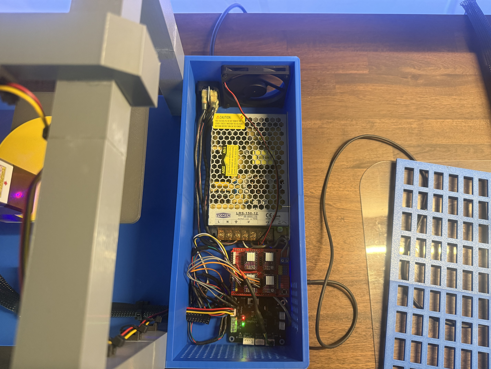
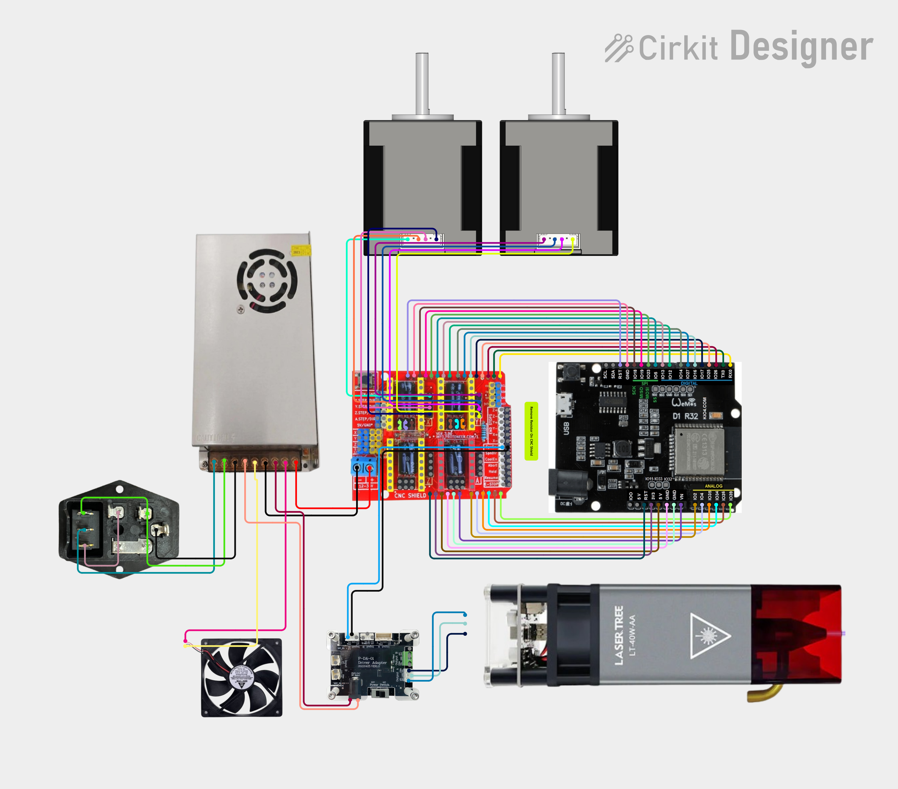

# 100 mm XY Laser CNC

I designed and built this small laser CNC around two 100 mm linear stages and a LaserTree 5 W module. The frame, laser-height adjustment, and electronics enclosure were modeled in SOLIDWORKS. A Wemos D1 R32 running FluidNC controls the two axis through a CNC Shield V3 and DRV8825 drivers.

  

[See all five SOLIDWORKS views](docs/cad-gallery.md)

## The finished machine

| Front | Electronics Box |
| --- | --- |
|  |  |

[See all six photos](docs/photos.md), including the laser mount, electronics, power inlet, and test piece.

[Download the video](https://github.com/danielsostaric7-del/100mm-xy-laser-cnc/raw/refs/heads/main/media/video/assembly-overview.mp4) · [Video notes](docs/video.md)

## Setup

- 100 mm travel on each axis
- 3,200 steps/mm with 1/32 microstepping
- 600 mm/min configured maximum travel rate
- FluidNC v4 on a Wemos D1 R32
- 5 kHz laser PWM on GPIO19

The full pinout and motion settings are in [config.yaml](firmware/config.yaml).

## Circuit diagram

Click the diagram to open it at full size.

## Project files

| File or folder | What's inside |
| --- | --- |
| [CNC Assembly.SLDASM](cad/CNC%20Assembly.SLDASM) | The complete machine assembly |
| [CAD folder](cad/) | SOLIDWORKS parts and subassemblies |
| [FluidNC configuration](firmware/config.yaml) | Pin assignments and machine settings |
| [Circuit diagram](docs/circuit-diagram.md) | Wiring layout |
| [Bill of Material](docs/BOM.md) | Main parts and purchase links |

Keep the CAD folders together when opening the main assembly so SOLIDWORKS can find the referenced parts.

## Safety

This machine uses a high-power laser and electricity. The open frame shown here is not a laser-safe enclosure. Use a suitable enclosure, emergency stop, ventilation, and laser eyewear rated for the wavelength. Check grounding, polarity, driver current limits, and the laser's off-state before running it. Never leave it operating unattended.

