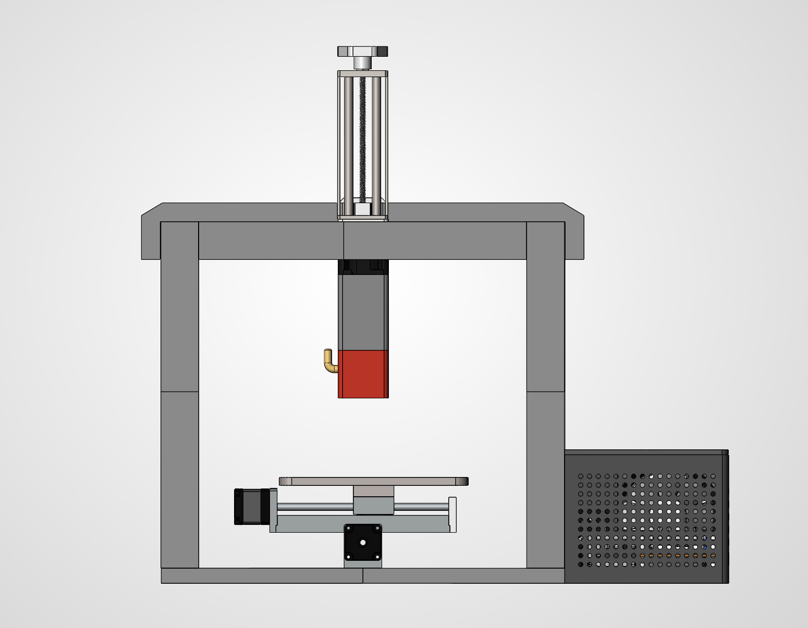
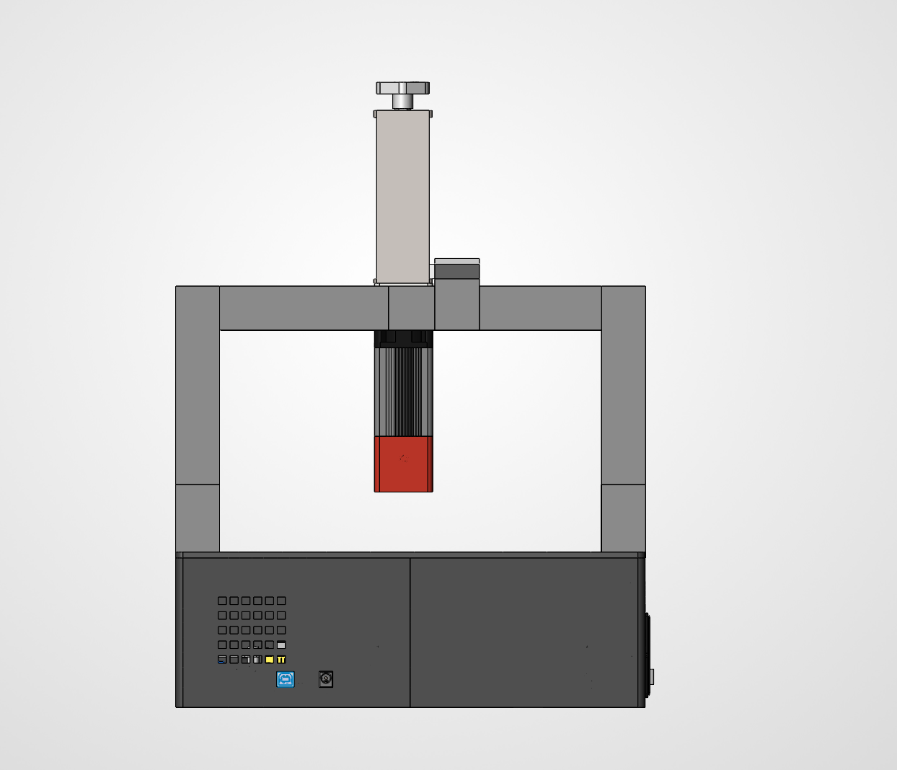
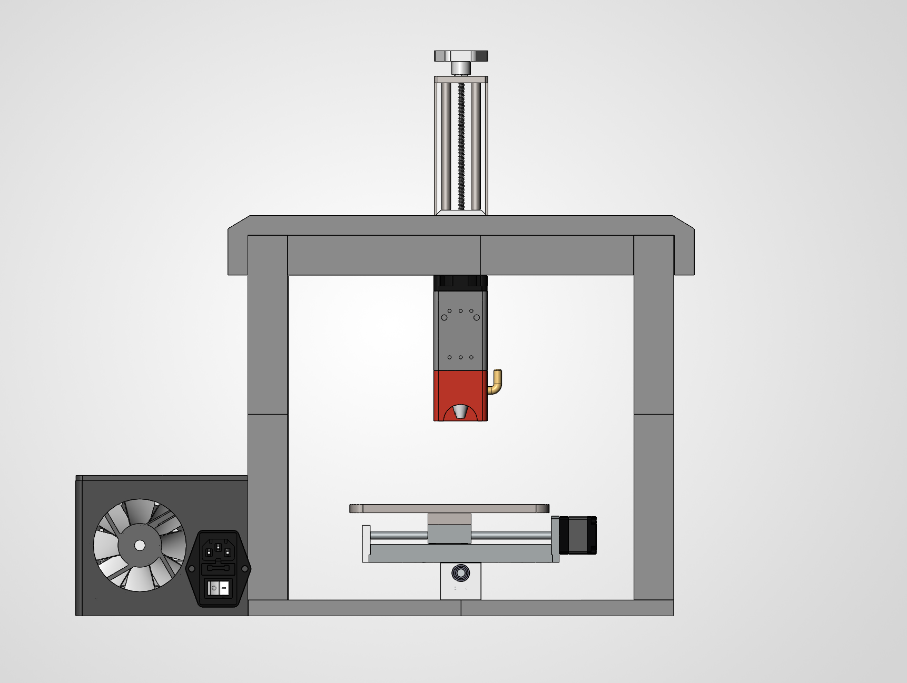
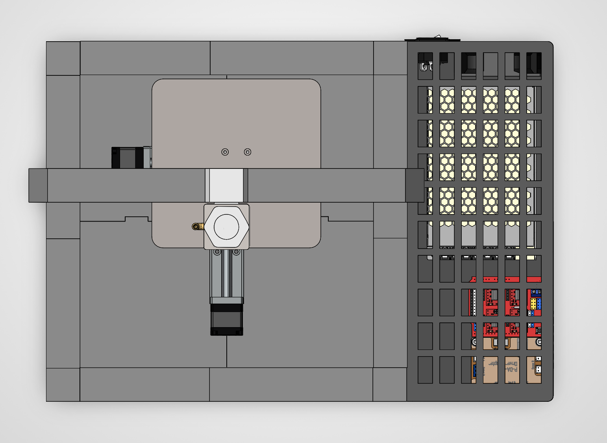

# SOLIDWORKS screenshots

Five views of the full CNC assembly, captured directly in SOLIDWORKS.

## Isometric

| Front | Side |
| --- | --- |
|  |  |

| Back | Top |
| --- | --- |
|  |  |

Click a screenshot to view it at full size.

[Open the assembly file](../cad/CNC%20Assembly.SLDASM) · [See the finished machine](photos.md) · [Back to the project](../README.md)
