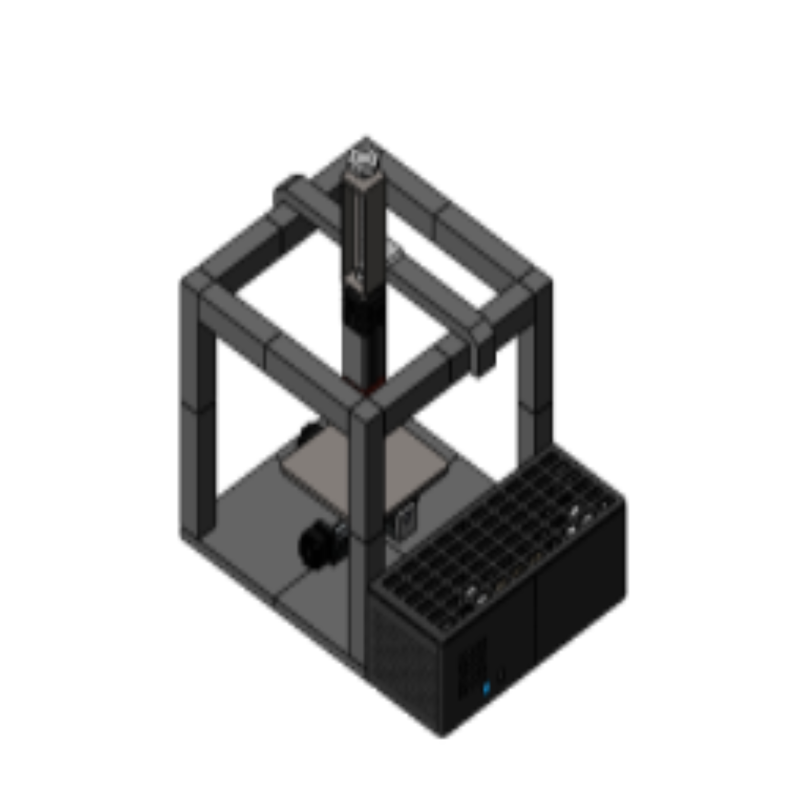
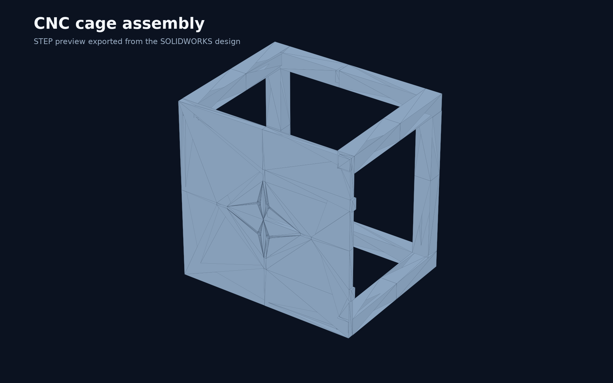
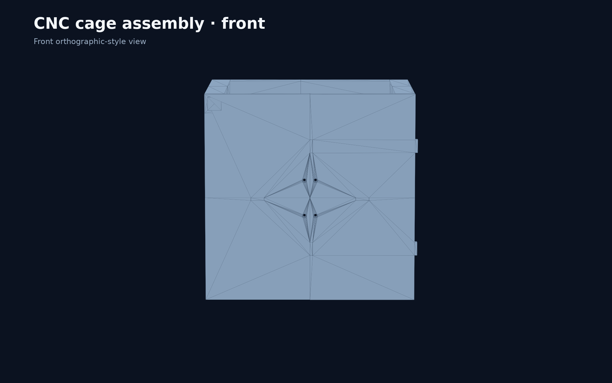
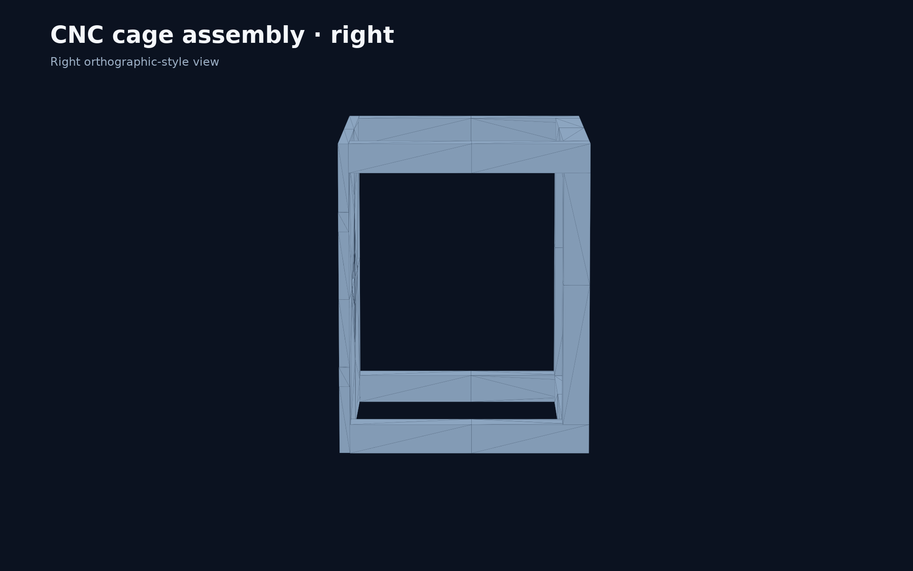
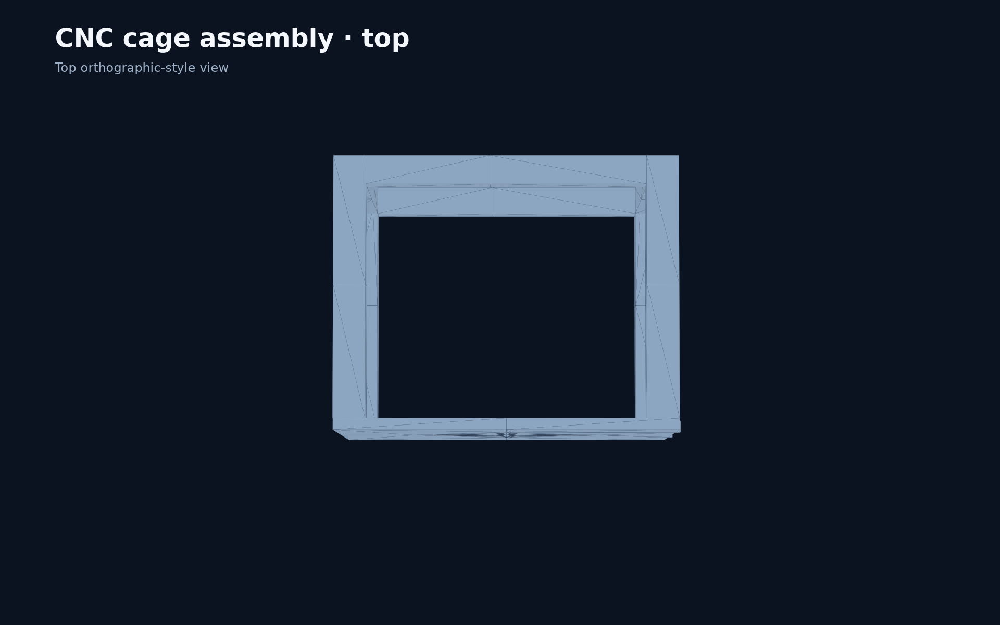
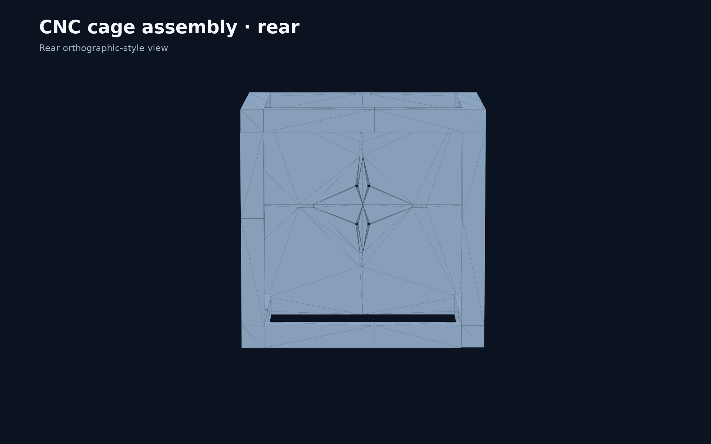
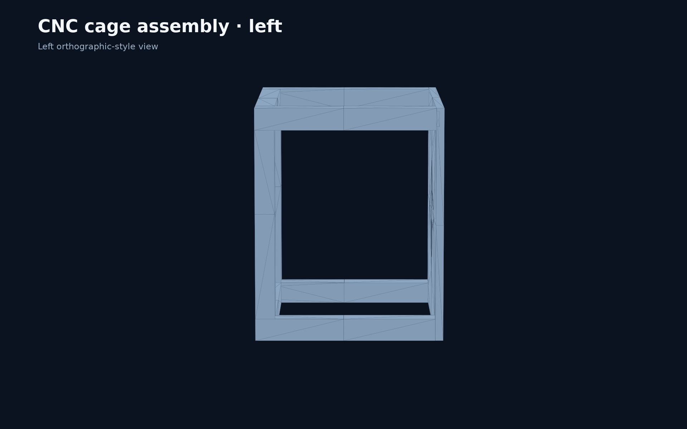
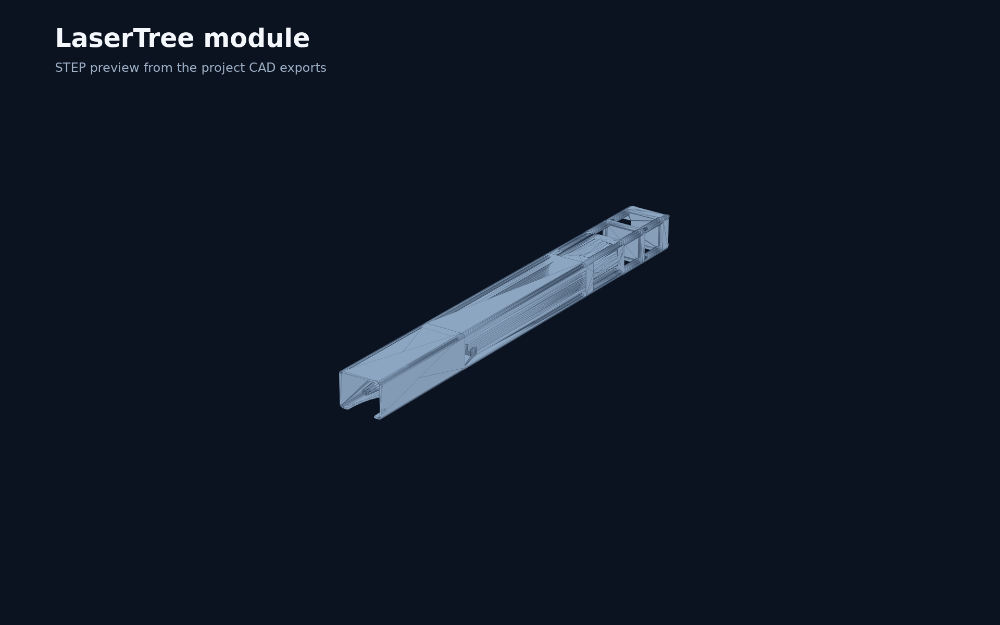
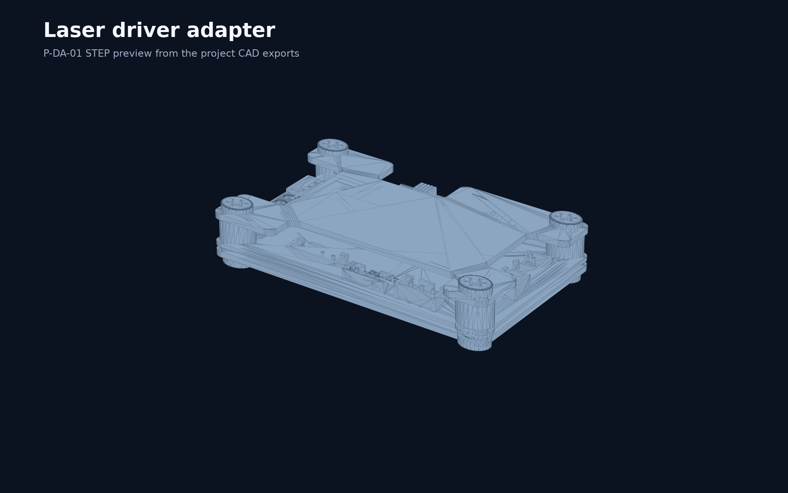

# CAD preview gallery

The authoritative design files are the native SOLIDWORKS assemblies and parts under [`cad/`](../cad/). These preview images are retained as documentation assets even though intermediate STEP and STL exports are intentionally omitted from the repository.

## Full CNC assembly

Source: [`cad/CNC Assembly.SLDASM`](../cad/CNC%20Assembly.SLDASM)

## Cage subassembly

Source: [`cad/Cage/CNC_Cage_Assembly.SLDASM`](../cad/Cage/CNC_Cage_Assembly.SLDASM)

| View | Preview |
| --- | --- |
| Isometric |  |
| Front |  |
| Right |  |
| Top |  |
| Rear |  |
| Left |  |

## Key components

| Component | Preview |
| --- | --- |
| LaserTree module |  |
| P-DA-01 driver adapter |  |
