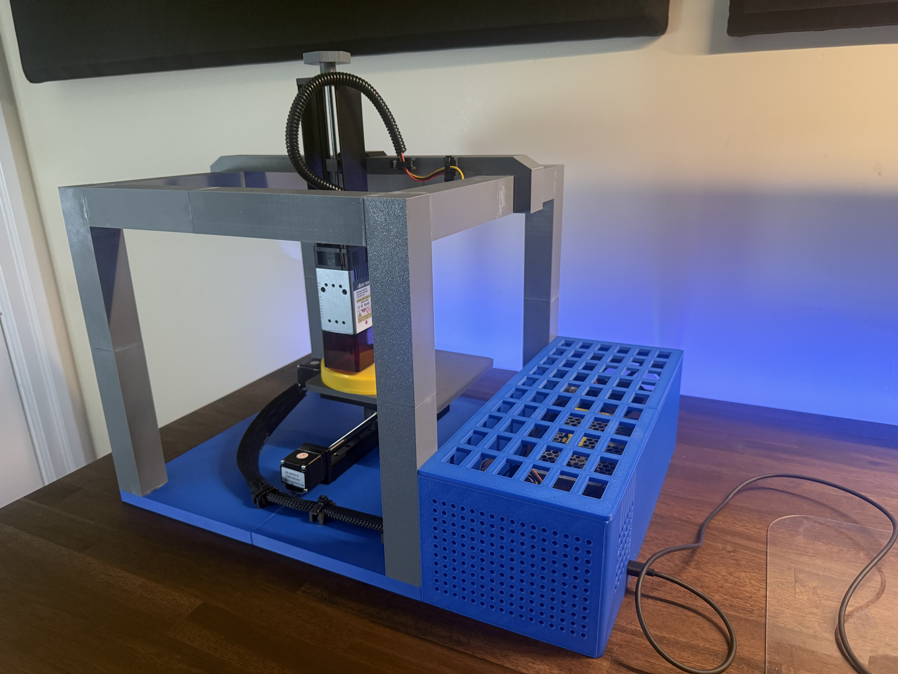
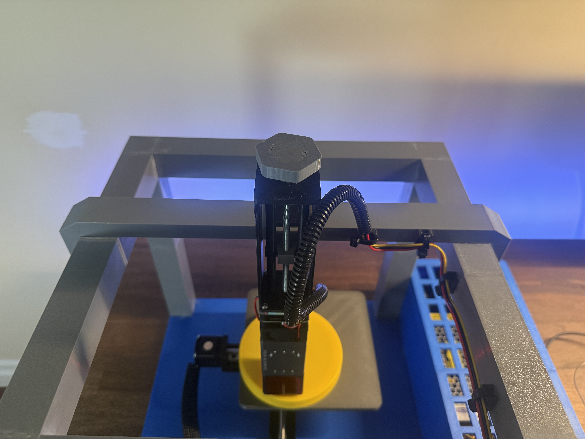
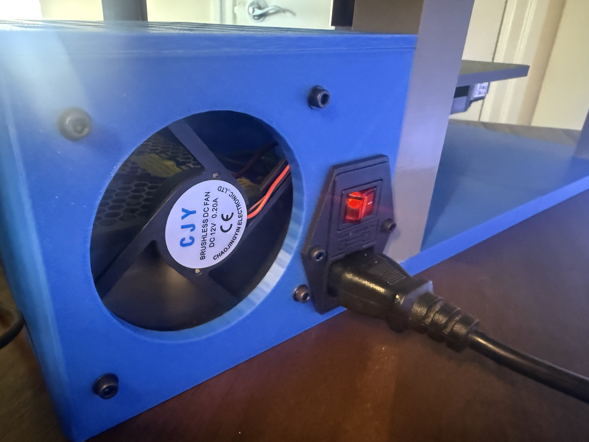
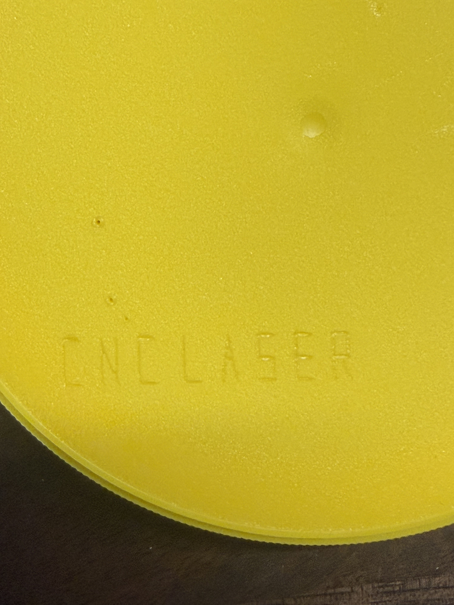

# Photos

The finished machine, a closer look at the hardware, and a test piece.

| Front | Side |
| --- | --- |
|  |  |

| Laser mount and height adjustment | Inside the electronics enclosure |
| --- | --- |
|  |  |

| Power inlet and cooling fan | Test piece |
| --- | --- |
|  |  |

Click a photo to view it at full size.

[SOLIDWORKS screenshots](cad-gallery.md) · [Circuit diagram](../media/diagrams/circuit-diagram.png) · [Back to the project](../README.md)
